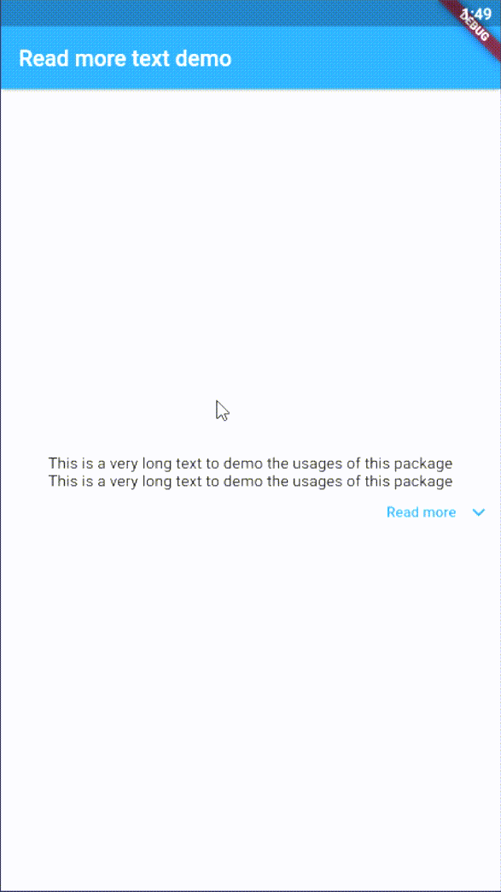

<!-- 
This README describes the package. If you publish this package to pub.dev,
this README's contents appear on the landing page for your package.

For information about how to write a good package README, see the guide for
[writing package pages](https://dart.dev/guides/libraries/writing-package-pages). 

For general information about developing packages, see the Dart guide for
[creating packages](https://dart.dev/guides/libraries/create-library-packages)
and the Flutter guide for
[developing packages and plugins](https://flutter.dev/developing-packages). 
-->

A super fast lightweight easy to use package to implement read more functionality in your app.
It's responsive to different screen sizes, and supports all platforms.

## Features

The [Read more text](https://pub.dev/packages/read_more_text) is an easy to use yet powerful, 
and high customizable widget that brings the read more functionality to your app:

* Lightweight and super easy to use.
* Works with all locales.
* Allow customize the main text, text read more/less `TextStyle`.
* Customizable alignment of the read more/less widget.
* Handler that is called whenever read more/less is clicked.
* You can use custom icons for read more and read less, or hide the icon entirely if you 
don't need it.
* **[New]:** You can now use the named constructor `ReadMoreText.selectable` selectable to 
instruct the package to use `SelectableText` widget instead of `Text` widget with all the customization like `cursorColor`, `cursorWidth`, and `cursorHeight`, etc...

## Usage

add to your pubspec.yaml:

```dart
read_more_text: ^0.0.4
```

then import it to your file:

```dart
import 'package:read_more_text/read_more_text.dart';
```

then use it:

```dart
ReadMoreText(
    'This is a very long text to demo the usages of this package\n'
    'This is a very long text to demo the usages of this package\n'
    'This is a very long text to demo the usages of this package\n'
    'This is a very long text to demo the usages of this package',
    numLines: 2,
    readMoreText: 'Read more',
    readLessText: 'Read less',
)
```

The result will be:


